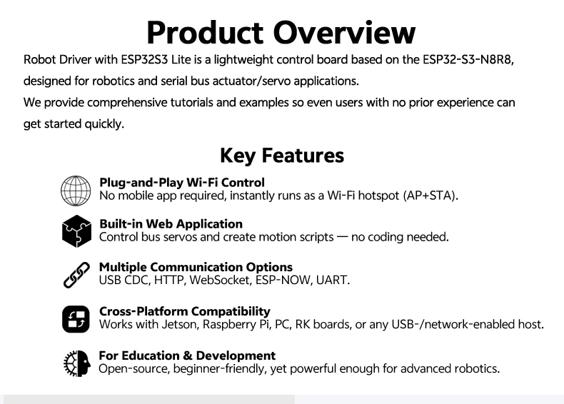
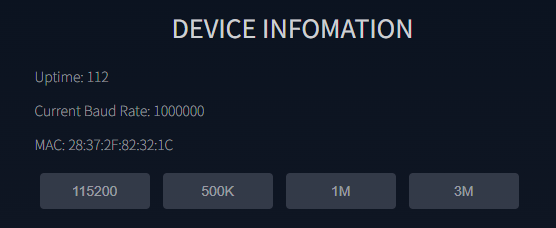

 

  

# Quick Start Guide
This guide is for the **Robot Driver with ESP32S3 Lite** (referred to as **the Driver Board**).

It is designed for first-time users and will help you get started quickly:

- Learn the basics of the built-in Web App
- Control Feetech bus servos (STS / HLS / SMS / SCS, via TTL single-wire or RS485) using example routines
- Extend later to LYgion hub motors and joint actuators (via CAN bus)

## Product Overview

- **Model Name:** Robot Driver with ESP32S3 Lite
- **Applications:**
    - Works as a standalone robot controller
    - Controls bus devices such as servos, hub motors, and actuators (built-in TTL, RS485, CAN)
    - Acts as a sub-controller for high-frequency interpolation tasks
    - Cooperates with a Raspberry Pi, Jetson, or PC to build a layered “big brain + small brain” control system

---

## Web Application

The Driver Board comes pre-loaded with a Web App.

No extra software is needed—just connect with a smartphone or PC browser to access the control panel.

---

## Power Supply Guide

- **Peripheral Power**
    
    Servos, hub motors, and actuators require power through the **DC jack or XT30 (2+2)**.
    
    These peripherals will only operate when the Driver Board’s **power switch is ON**.
    
- **Operating Voltage**
    
    Match the input voltage with your device (e.g., use a 12V supply for 12V servos).
    
    The supply rail is directly connected to control ports and supports brief high-current peaks.
    
- **Board Functions**
    
    Onboard features such as the OLED display, buzzer, joystick switch, and Wi-Fi run with **USB Type-C power only**.
    
- **USB Power Only**
    
    Plugging in Type-C automatically powers the board, regardless of the switch position
    
    (the switch only controls peripheral power).
    

---

## Startup and Web App Access

1. **Power On**
    - When using DC / XT30 power, flip the switch to **ON**.
    - Indicators:
        - Buzzer beeps once (sound may be faint if the hole is blocked).
        - OLED shows AP/STA IP information (STA IP will be blank if Wi-Fi is not yet configured).
2. **Connect to Hotspot (AP mode)**
    - On startup, the Driver Board creates a Wi-Fi hotspot:
        - SSID: `Robot`
        - Password: `12345678`
    - For multi-device setups, change the default SSID and password.
    - Even if your phone/PC shows “No Internet,” stay connected.
3. **Open the Control Page**
    - Launch Chrome, Edge, Safari, or Firefox.
    - Enter: `192.168.4.1`
    - The Web control interface will appear.
        
        
        
4. **Connect to Existing Wi-Fi (STA mode)**
    - Open **Wi-Fi Setting** in the Web App.
    - Enter your router SSID and password.
    - On success, the OLED shows the assigned IP next boot.
    - From the same LAN, open this IP in your browser to access the Web App.

---

## Web App Components

Below are the main modules inside the Web App.

### Device Info

- Displays real-time system information.
- Communication uses **WebSocket** (a low-latency protocol). `Uptime` increases every second if the system is running normally.
- **Current Baud Rate** shows the communication rate between the ESP32S3 and servos/motors (default 1 Mbps).
    - All devices on the same bus must share the same baud rate.
    - You can switch baud rate using preset buttons or custom JSON commands.
- **MAC** shows the unique ESP32S3 network address (used in ESP-NOW communication).

---

### Wi-Fi Settings
 **Wi-Fi Modes of ESP32-S3**

- **AP Mode (Access Point)** – The board acts as a Wi-Fi hotspot (default SSID `Robot`). Devices connect directly, and the board is accessed at `192.168.4.1`.
- **STA Mode (Station)** – The board joins your existing Wi-Fi, and you access it via the router-assigned IP.
- **Mixed Mode** – Both AP + STA run at the same time (default firmware behavior).

In the Web App:

- **AP_SSID / AP_PWD** – Configure the hotspot name & password (defaults: `Robot` / `12345678`).
- **STA_STATUS** – Shows the connected Wi-Fi SSID and IP (blank if not connected).
- **STA_SSID / STA_PWD** – Enter your router Wi-Fi credentials, then press **SET WIFI**.

---

### Servo Control

Supports Feetech servos (STS, SMS, HLS, SCS).

- **ID** – Target servo ID. `254` is the broadcast ID (affects all connected servos—recommended only when configuring a single servo).
- **Pos** – Target position (absolute steps).
- **Spd** – Speed (steps/s, `0` = max).
- **Acc** – Acceleration (steps/s², `0` = max).
- **Release** – Disable torque, allowing free manual movement.
- **Torque** – Enable torque, holding the servo at its target.
- **Feedback** – Reads current servo position into the Pos box.
- **Calibration** – Sets current position as servo midpoint.
- **Add / Action** – Build or send commands (automatically generates JSON for scripts).
- **Change ID** – Assigns a new ID.
- **Delay(ms)** – Insert time gaps between commands (important for scripted actions).

HLS and SCS servo panels provide similar controls, with model-specific features such as **Current Limit** (HLS) and **Time (ms)** (SCS).

---

### Automation Scripts

Enables multi-servo choreography.

- Use **Add** buttons in Servo Control to insert JSON commands and delays into the script editor.
- Scripts can be bound to the onboard joystick:
    - `Up`, `Down`, `Left`, `Right` → saved as `up.mission`, `down.mission`, etc.
    - Triggered when the joystick is pressed in those directions.
- **On Boot** – Saves as `boot_user.mission`, auto-runs on every boot in a loop (multithreaded, does not block other functions).
- **STOP MISSION** – Stops the currently running mission.
- **Delete Mission** – Removes stored tasks.

Example: Script four servos with sequential moves by inserting JSON lines separated by line breaks.

---

### JSON Command Interface

JSON is the universal control method of the Driver Board.

Every Web App action translates into JSON commands, making it easy to debug, extend, and integrate with external programs.

- Use the **JSON Interface** text box to enter custom JSON commands.
- Press **SEND** to execute immediately (no upload needed).
- A command library is provided—clicking an entry auto-fills the text box for quick editing.

With JSON, you can:

- Control servos and motors
- Configure Wi-Fi or ESP-NOW
- Manage the OLED display and buzzer
- Interact with the file system
- Customize board settings

Because JSON is both machine-friendly and human-readable, it’s ideal for scripting and automation.

---

## Summary

The **Robot Driver with ESP32S3 Lite** is a versatile controller for robotics projects—from beginner experimentation to advanced multi-actuator systems. Its browser-based Web App provides immediate access without extra software, while JSON commands and automation scripts unlock deep customization.

Start simple with Wi-Fi setup and servo tests, then expand into complex robot control using JSON scripting and integration with your own software.
